# KimGSeok

## 🔭 Current Outsourcing Projects
- [Tensports Github] https://github.com/tennispick
- [Tensports Project] [https://github.com/tennispick](https://tennis-pick.com/login)

## 🌱 I'm currently learning
- 쏙쏙 들어오는 함수형 코딩
- 이펙티브 타입스크립트
- 자바스크립트 코딩테스트
- 테스트주도 개발 시작하기

## 📫 How to reach me
- [LinkedIn] www.linkedin.com/in/kimgyeongseok
- [Email] rla99tjr@gmail.com
  

<!-- tailwindcss -->
<!-- styled-components -->
<!-- SCSS -->
<!-- Jquery -->
<!-- git -->
<!-- BE -->
<!-- node.js -->
<!-- nest.js -->

