# KimGSeok

**kimGyeongSeok-web/kimGyeongSeok-web** is a ✨ _special_ ✨ repository because its `README.md` (this file) appears on your GitHub profile.
http://github-profile-summary-cards.vercel.app/api/cards/stats?username=KimGSeok&theme=github

Here are some ideas to get you started:

- 🔭 I’m currently working on ...
- 🌱 I’m currently learning ...
- 👯 I’m looking to collaborate on ...
- 🤔 I’m looking for help with ...
- 💬 Ask me about ...
- 📫 How to reach me: ...
- 😄 Pronouns: ...
- ⚡ Fun fact: ...

<!-- tailwindcss -->
<!-- styled-components -->
<!-- SCSS -->
<!-- Jquery -->
<!-- git -->
<!-- BE -->
<!-- node.js -->
<!-- nest.js -->
